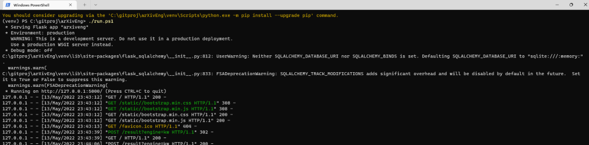
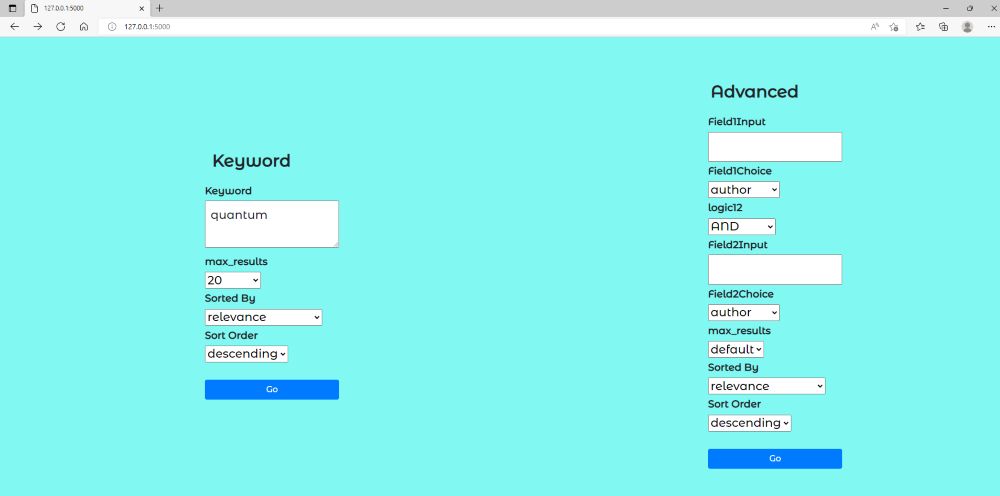
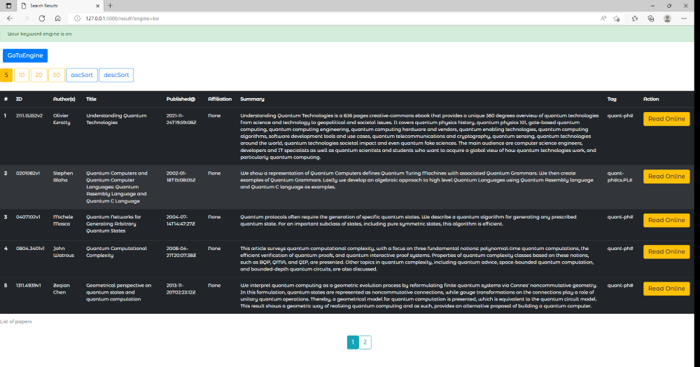

# arXivEng

This is a small practice project on `Flask` framework and a simple database `SQLAlchemy`.
The purpose is to wrap the arXiv search engine API `arxiv.query()` in a web interface.

### How to use
Git clone this repository
```shell
git clone git@github.com:LarsonLaugh/arXivEng.git
```
A good practice would be to start with a virtual environment `venv` and activate it
```shell
python3 -m virtualenv venv
venv/Scripts/activate
```
Then install all the dependencies
```shell
pip3 install -r requirements.txt
```
This is for installation and setup.

For using it afterwards. Go to the terminal (here is PS) and type
```shell
./run.ps1
```
You will get the app run in the default WSGI server (not for production) at
http://127.0.0.1:5000 and use your favorite browser. Have fun! For better
deployment, one can employ gunicorn as the WSGI and Nginx to handle the internet 
request. 



### Interface


There are two ways to search in general: by keyword or more advanced field search.



The results will be displayed in a table-like list. One can choose how many results shown 
on each page from 5 to 50m and also how to sort the results in a `descend` or `ascend` order.
At the bottom center, one can go to any of the pages by clicking on the numbers.
Clicking `Read Online` button will bring one to the pdf downloading page, and you can save simply
for later reading.


